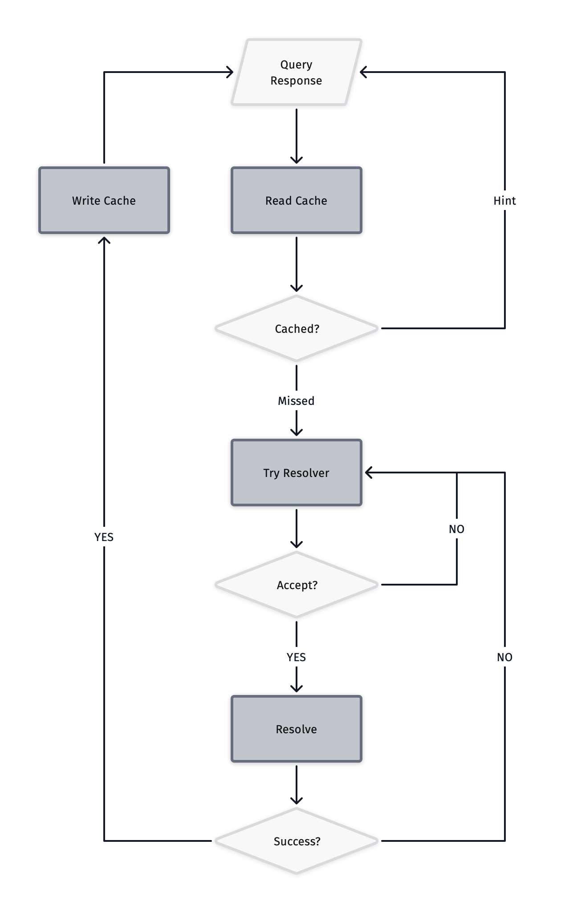

# DNS-Switchy

基于规则的 DNS 代理，按域名将请求路由到不同的上游解析器。支持 UDP DNS、DoH、DoT，内置缓存和热重载。

## 功能

- **Resolver 链**：按顺序匹配，第一个命中的 resolver 处理请求
- **域名规则**：后缀匹配、精确匹配、关键字、正则表达式，支持黑名单
- **多种上游协议**：UDP、DNS-over-HTTPS (DoH)、DNS-over-TLS (DoT)、DNSCrypt
- **v2fly 域名列表**：原生集成 [v2fly/domain-list-community](https://github.com/v2fly/domain-list-community)，自动下载缓存
- **本地解析**：hosts 文件、dnsmasq 租约文件
- **全局缓存**：按 resolver 或全局 TTL 缓存响应
- **热重载**：修改配置文件后自动重载，无需重启
- **HTTP API**：可选的 HTTP 查询接口
- **Web Portal**：内置 Web 管理页面，通过浏览器查询 DNS 解析结果（域名 + 类型 → resolver 名称 + 解析结果），查询不走缓存

## 快速开始

```bash
go build -o dns-switchy
./dns-switchy -c config.yaml
```

命令行参数：

| 参数 | 默认值 | 说明 |
|------|--------|------|
| `-c` | `config.yaml` | 配置文件路径 |
| `-x` | `false` | 日志中显示时间戳 |

程序启动后在配置的 UDP 端口监听 DNS 请求。修改配置文件会自动触发热重载。

## 处理流程



## 配置概览

```yaml
addr: ":1053"
ttl: 5m
http: ":8080"          # 可选，HTTP API + Web Portal
resolvers:
  - type: forward
    name: cn-dns
    ttl: 600s
    url: 114.114.114.114
    rule:
      - cn
      - v2fly:cn
  - type: forward
    name: cf-dns
    url: https://cloudflare-dns.com/dns-query
```

完整的配置参考和所有 resolver 类型详见 [USAGE.md](USAGE.md)。
