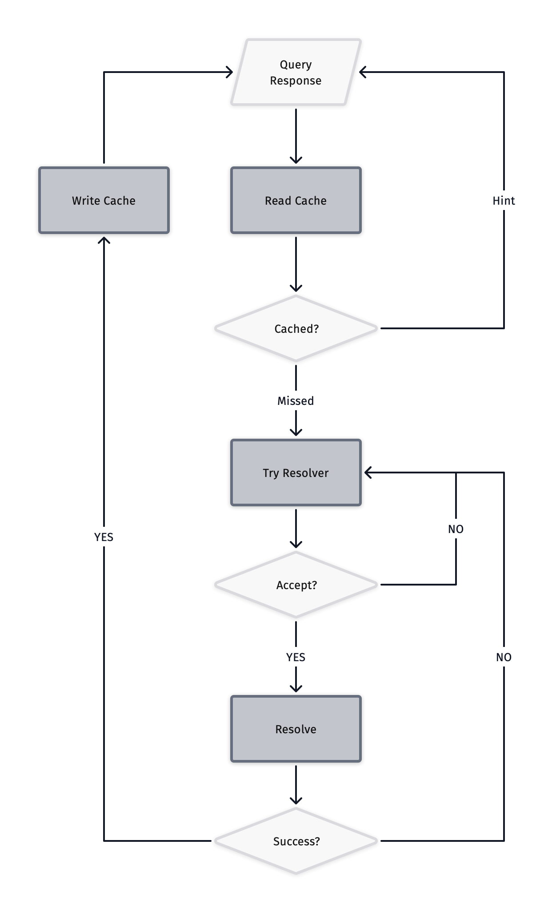

# DNS-Switchy

基于规则的 DNS 代理，按域名将请求路由到不同的上游解析器。支持 UDP DNS、DoH、DoT，内置缓存和热重载。

## 功能

- **Resolver 链**：按顺序匹配，第一个命中的 resolver 处理请求
- **域名规则**：后缀匹配、精确匹配、关键字、正则表达式，支持黑名单
- **多种上游协议**：UDP、DNS-over-HTTPS (DoH)、DNS-over-TLS (DoT)、DNSCrypt
- **v2fly 域名列表**：原生集成 [v2fly/domain-list-community](https://github.com/v2fly/domain-list-community)，自动下载缓存
- **本地解析**：hosts 文件、dnsmasq 租约文件
- **全局缓存**：按 resolver 或全局 TTL 缓存响应
- **nftset 策略路由**：resolver 解析出的 A 记录可自动写入 nftables 集合（带 timeout），供路由器按域名做策略路由（本期仅 IPv4）
- **mDNS 桥接**：把 DNS-only 客户端（容器 / VM / 无 avahi 的 Linux）的 `.local` 主机名查询桥接到 LAN mDNS，回设备自宣告的活答案（querier-only，不宣告不应答；详见 USAGE 与 `docs/adr/0001`）
- **热重载**：修改配置文件后自动重载，无需重启
- **HTTP API**：可选的 HTTP 查询接口
- **Web Portal**：内置 Web 管理页面——浏览器查询 DNS 解析结果，并可**结构化表单在线编辑 resolvers**（校验 + 备份 + 热替换，详见下文）

## 快速开始

```bash
go build -o dns-switchy
./dns-switchy -c config.yaml
```

命令行参数：

| 参数 | 默认值 | 说明 |
|------|--------|------|
| `-c` | `config.yaml` | 配置文件路径 |
| `-x` | `false` | 日志中显示时间戳 |

程序启动后在配置的 UDP 端口监听 DNS 请求。修改配置文件会自动触发热重载。

## Web Portal

设置 `http` 后，浏览器访问 `http://<host>:<port>/` 即可使用内置管理页面，含两块功能：

- **Lookup**：输入域名 + 类型，查看由哪个 resolver 解析及结果（不走缓存）。
- **Config**：以结构化表单**在线编辑 resolvers**——增删 / 调序 resolver（顺序即匹配优先级）、按 type 编辑字段、逐条编辑规则（`v2fly:` / `include:` / `!黑名单` / `keyword:` / `regexp:` 原样保留）。保存前校验、自动备份旧配置、原子写盘并热替换 resolver 链；保存失败不写盘，运行中的 DNS 解析全程不中断。

**作用域与安全**：

- Web 仅能改 `resolvers`；顶层 `addr` / `http` / `nftset_table` / `ttl` 为只读（如需修改请直接编辑配置文件）。
- 保存会重写配置文件，**保留 `v2fly:` / `include:` 等指令与未知字段，但不保证保留 YAML 注释 / 原始格式**；旧配置存为带时间戳的 `.bak` 备份。
- **鉴权（api-key）**：配置顶层的 `api_key` 非空时，**全部 `/api/*`（含只读的查询与配置读取）都要求请求头 `X-Api-Key`**，不匹配一律 401；比较为常量时间。静态资源与 `/panel.js` 不鉴权（否则连输 key 的界面都打不开）。
- `api_key` 缺省为空 = **不启用鉴权**，行为与旧版完全一致（向后兼容）。
- 启用 api-key 后，它**取代**了原先的 Origin/Referer 同源（CSRF）校验：浏览器跨站请求带不上自定义头，鉴权本身即是更强的 CSRF 防护。未配置 `api_key` 时同源校验照旧生效。Content-Type 必须为 `application/json`、请求体上限 1 MiB 两条防护始终生效。
- `GET /api/config` 返回的 `api_key` 字段会被掩码成 `***`（写回只替换 `resolvers`，顶层一律取磁盘原文，掩码不会写进配置文件）。
- 仍建议**仅在可信内网使用**：一把 key 等同于改上游 DNS 的完整写权限。

HTTP 接口（`http` 开启时）：

| 方法 & 路径 | 说明 |
|------|------|
| `GET /api/query?question=<域名>&type=<类型>` | DNS 查询（不走缓存） |
| `GET /api/config` | 读取当前配置（JSON）+ 内容版本号 |
| `POST /api/config/validate` | 校验一组 resolvers（解析 + 构造 + 严格检查），不写盘 |
| `POST /api/config` | 保存 resolvers（需带版本号做乐观并发 + 备份 + 热替换） |

**OpenWrt**：包内 init.d 让守护进程直接以 `/etc/dns-switchy/config.yaml`（持久分区）为唯一配置，因此 web 编辑**持久保存、重启不丢**；监听端口仍由 UCI `http_port`（LuCI 可改）掌控，启动 / UCI 变更时会幂等同步进该文件。LuCI 页面以 iframe 内嵌此 portal；若配了 `api_key`，iframe 内的面板首次访问会要求输入一次 key（存浏览器 localStorage）。

### 前端（web/portal）

Portal 是 Preact + Vite 工程，产出**单文件自包含 ES module** `panel.js`，注册两个 custom element（面板契约 v1）：

| 元素 | 用途 |
|------|------|
| `<dns-card api-base="/api">` | 总览卡片：服务状态摘要 + 快捷 DNS lookup |
| `<dns-panel api-base="/api">` | 完整管理页：lookup + resolvers 结构化编辑 |

两者都用 Shadow DOM（open），样式（Pico.css v2 + `src/tokens.css`）全部内联进 JS，不请求任何外部资源；`api-base` 在挂载时读取一次。key 存 `localStorage['dns.apiKey']`，收到 401/403 时面板内渲染 key 输入界面。

构建产物落在 `web/dist/`，由 `server.go` 的 `//go:embed all:web/dist` 打进单二进制，**产物需要提交进仓库**（CI 只跑 `go build`，不装 node）：

```shell
cd web/portal
npm install
npm run build          # -> web/dist/{panel.js,index.html}
npm test               # 纯函数单测（vitest）
npm run test:e2e       # E2E：起真的 dns-switchy 进程，用 Playwright 驱动面板
npm start              # 本地开发（PORTAL_API_TARGET=http://127.0.0.1:8080 可代理到真后端）
```

## 处理流程



## 配置概览

```yaml
addr: ":1053"
ttl: 5m
http: ":8080"            # 可选，HTTP API + Web Portal
api_key: "..."           # 可选，非空则全部 /api/* 要求 X-Api-Key；缺省不鉴权
nftset_table: "inet fw4" # 可选，nftset 写入的目标表/族，默认 inet fw4
resolvers:
  - type: forward
    name: corp-dns
    ttl: 600s
    url: 114.114.114.114
    rule:
      - corp.example
    nftset: corp4          # 可选，把该 resolver 的 A 答案写进 corp4 集合
    nftset_ttl: 1h         # 集合元素 timeout，须 ≥ 该 resolver 缓存 TTL
  - type: forward
    name: cf-dns
    url: https://cloudflare-dns.com/dns-query
```

完整的配置参考和所有 resolver 类型详见 [USAGE.md](USAGE.md)。
